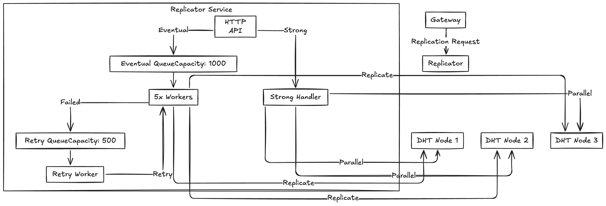
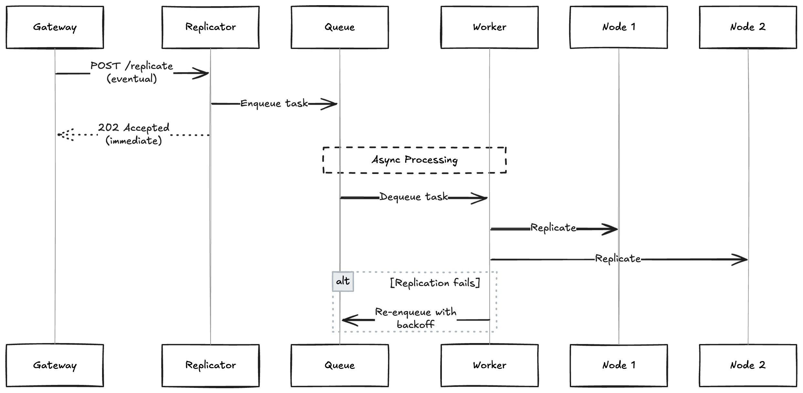
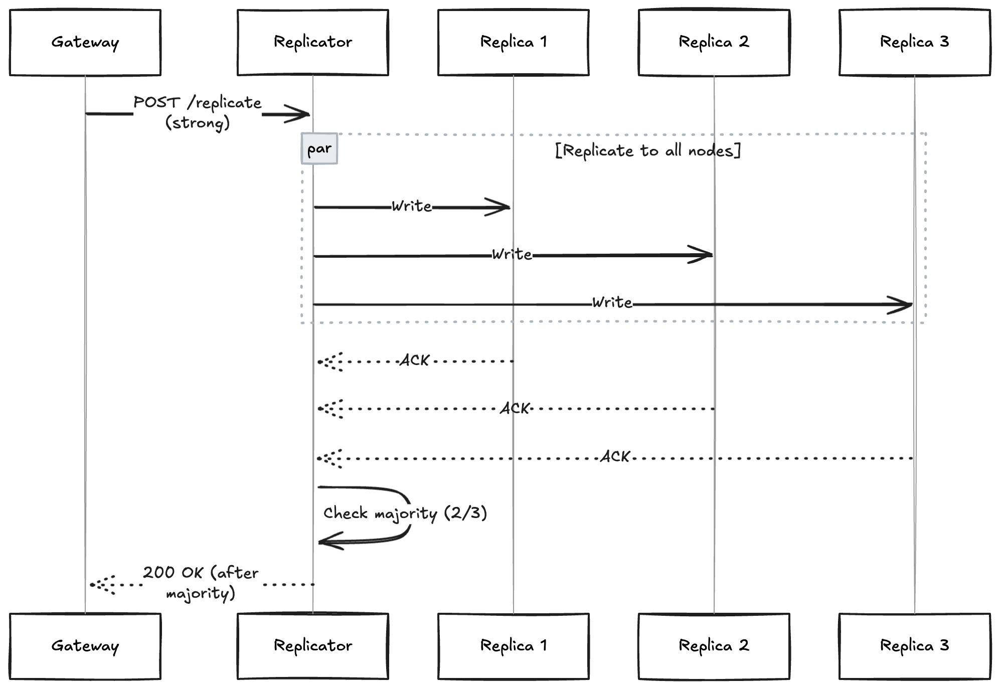

# Replicator Service

The Replicator service manages data replication across DHT nodes with support for both eventual and strong consistency.

## Overview

The Replicator handles:
- **Eventual Consistency**: Async replication with retry logic
- **Strong Consistency**: Synchronous replication with majority quorum
- **Retry Queue**: Automatic retries for failed replications
- **Metrics**: Track replication performance and failures

## Architecture


## Consistency Models

### Eventual Consistency


**Characteristics:**
- Primary acknowledges immediately
- Replication happens in background
- Eventual: data will be replicated "eventually"
- **Latency:** ~100ms (primary write only)
- **Use case:** High-throughput, non-critical data

### Strong Consistency


**Characteristics:**
- Wait for majority of replicas to acknowledge
- Majority = (N/2) + 1, where N = number of replicas
- **Latency:** ~300-500ms (includes replication)
- **Use case:** Critical data, financial transactions

## Configuration

Environment variables:
```bash
REPLICATOR_PORT="8085"
```

## Running
```bash
go run cmd/replicator/*.go=
```

## Endpoints

### POST /replicate

Trigger replication for a key.

**Request:**
```json
{
  "key": "user:123",
  "value": "base64-encoded-data-or-raw",
  "operation": "SET",
  "ttl": 3600000000000,
  "consistency": "eventual",
  "primary_node": "http://localhost:8082",
  "replica_nodes": [
    "http://localhost:8083",
    "http://localhost:8084"
  ],
  "user_id": 1
}
```

**Fields:**
- `key`: Key to replicate
- `value`: Value as bytes (for SET operations)
- `operation`: "SET" or "DELETE"
- `ttl`: Time-to-live in nanoseconds (0 = no expiration)
- `consistency`: "eventual" or "strong"
- `primary_node`: Primary node URL (for reference)
- `replica_nodes`: List of replica node URLs
- `user_id`: User ID (for metrics)

**Response (Eventual):** `202 Accepted`
```json
{
  "success": true,
  "node_id": "replicator"
}
```

**Response (Strong):** `200 OK`
```json
{
  "success": true,
  "node_id": "replicator",
  "acked_nodes": [
    "http://localhost:8083",
    "http://localhost:8084"
  ]
}
```

**Errors:**
- `400`: Invalid request body or consistency level
- `503`: Queue full (eventual) or replication timeout (strong)

---

### GET /metrics

Get replication metrics.

**Example:**
```bash
curl http://localhost:8085/metrics
```

**Response:** `200 OK`
```json
{
  "total_replications": 5420,
  "successful_replicas": 10782,
  "failed_replicas": 58,
  "queue_size": 23,
  "average_ack_time_ms": 45.7,
  "max_replication_lag_ms": 1234.5,
  "retries_in_progress": 2
}
```

**Metrics:**
- `total_replications`: Total replication requests received
- `successful_replicas`: Number of successful replica writes
- `failed_replicas`: Number of failed replica writes
- `queue_size`: Current size of eventual consistency queue
- `average_ack_time_ms`: Average acknowledgment time
- `max_replication_lag_ms`: Maximum replication lag observed
- `retries_in_progress`: Number of tasks in retry queue

---

### GET /health

Health check endpoint.

**Example:**
```bash
curl http://localhost:8085/health
```

**Response:** `200 OK`
```json
{
  "status": "healthy",
  "service": "replicator",
  "queue_size": 23
}
```

**Status Values:**
- `healthy`: Queue size < 900
- `degraded`: Queue size >= 900

## Worker System

### Eventual Consistency Workers

**Configuration:**
- Number of workers: 5
- Queue capacity: 1000 tasks
- Retry limit: 3 attempts
- Backoff: Exponential (2s, 4s, 6s)

**Worker Process:**
```
1. Dequeue task from eventual queue
2. For each replica node:
   a. Send HTTP request (PUT/DELETE)
   b. Record success/failure
3. If any failures and retries < 3:
   a. Increment retry counter
   b. Sleep (retry_count * 2 seconds)
   c. Enqueue to retry queue
4. Update metrics
```

### Retry Worker

**Purpose:** Handle failed replications with exponential backoff

**Process:**
```
1. Dequeue task from retry queue
2. Log retry attempt
3. Process like normal task
4. If still fails and retries < max:
   - Backoff again
   - Re-enqueue
5. If max retries exceeded:
   - Log permanent failure
   - Update failure metrics
```

## Replication Flow

### Eventual Consistency Flow
```
Client → Gateway → Primary Node → Gateway → Replicator
                                     ↓
                         [Queued for async replication]
                                     ↓
                        Worker Thread → Replica 1 → Success ✓
                                     → Replica 2 → Fail ✗
                                             ↓
                                    [Retry Queue after 2s backoff]
                                             ↓
                        Retry Worker → Replica 2 → Success ✓
```

### Strong Consistency Flow
```
Client → Gateway → Primary Node (write complete)
                        ↓
                   Replicator
                   ↙    ↓    ↘
            Replica1  Replica2  Replica3
                ACK     ACK       ACK
                   ↘    ↓    ↙
                Check Majority (2/3)
                        ↓
              Gateway → Client (200 OK)
```

## Retry Logic

### Retry Strategy
```go
// Exponential backoff
delay = retryCount * 2 * time.Second

// Example:
// Attempt 1: 2s delay
// Attempt 2: 4s delay
// Attempt 3: 6s delay
// After 3 attempts: permanent failure
```

### Retry Conditions

**Retry if:**
- Network error (connection refused, timeout)
- HTTP 5xx errors from replica
- Attempts < 3

**Don't retry if:**
- HTTP 4xx errors (bad request)
- Max retries exceeded
- Node explicitly returns "already replicated"

## Metrics & Monitoring

### Key Metrics

**Throughput:**
```bash
# Replications per second
(current_total - previous_total) / time_interval
```

**Success Rate:**
```bash
success_rate = successful_replicas / (successful_replicas + failed_replicas) * 100
```

**Average Latency:**
```bash
avg_latency = sum(ack_times) / count(ack_times)
```

**Queue Health:**
```bash
queue_utilization = queue_size / queue_capacity * 100
# Alert if > 90%
```

## Performance Tuning

### Queue Sizes
```go
// Adjust in replicator.go
eventualQueue: make(chan *ReplicationTask, 1000)  // Increase for high throughput
retryQueue:    make(chan *ReplicationTask, 500)   // Increase if many failures
```

### Worker Count
```go
// Adjust in main.go
for i := 0; i < 5; i++ {  // Increase workers for higher throughput
    r.wg.Add(1)
    go r.eventualWorker()
}
```

### Timeouts
```go
// Adjust in replicator.go
httpClient: &http.Client{
    Timeout: 5 * time.Second,  // Increase for slow networks
}
```

## Troubleshooting

### High Queue Size

**Symptom:** Queue size constantly > 800

**Solutions:**
1. Increase worker count
2. Optimize replica write performance
3. Check network latency to replicas
4. Scale horizontally (add more replicator instances)

### High Failure Rate

**Symptom:** `failed_replicas` increasing rapidly

**Solutions:**
1. Check replica node health
2. Verify network connectivity
3. Check replica node capacity
4. Review replica node logs

### Replication Lag

**Symptom:** `max_replication_lag_ms` > 5000ms

**Solutions:**
1. Increase worker count
2. Reduce retry delays
3. Check queue size (might be backed up)
4. Optimize replica write performance

### Memory Leak

**Symptom:** Replicator memory usage growing unbounded

**Solutions:**
1. Check for stuck tasks in queues
2. Verify goroutines are terminating
3. Monitor metric sample size (limit to 1000)
4. Check for circular references in tasks
